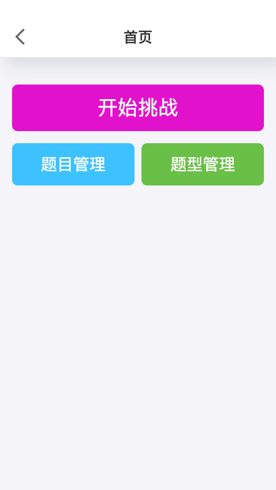
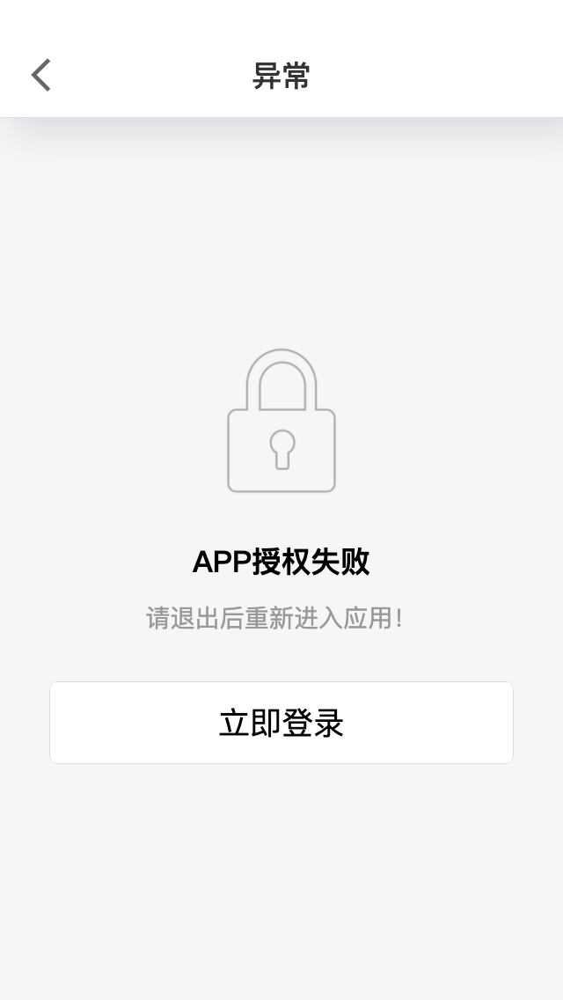

# React 移动端项目启动模板

技术栈

`umi` + `dva` + `antd-mobile` + `antd-mobile-exui` + `postcss-pxtorem` + `Typescript`

- `umi` 企业级前端应用框架 2.x 版本
- `dva` 数据流方案，简化开发体验 [官网](https://dvajs.com/guide/)
- `antd-mobile` [查看](https://mobile.ant.design/index-cn) + `antd-mobile-exui` UI 组件方案 [查看](http://120.76.205.115:8800/antd/index-cn)
- `postcss-pxtorem` 移动端适配。默认是 320 的适配，如果需要适配 750 等其他设计图，请修改
  - `postcss.config.js` 配置根字体
  - `document.ejs` 显示不同的字体大小
- `axios` 请求数据
- `js-cookie` cookie 操作
- `dayjs` 日期格式处理
- Typescript 支持
- `@formily` 强大的表单支持 [@formily/react](https://www.npmjs.com/package/@formily/react) [Formily](https://formilyjs.org/#/bdCRC5/dzUZU8il)

## screenshot

